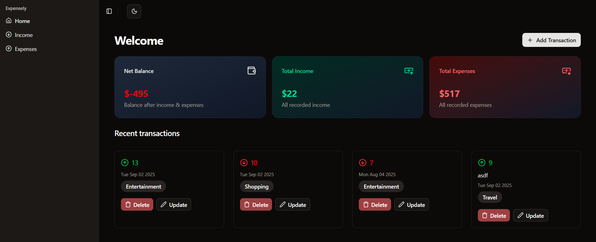

# Expensely

  
[Project demo](https://expensely-money.vercel.app/)

## Description

**Expensely** is a simple, clean, and minimalistic expense tracker built with **Next.js, Tailwind CSS, and ShadCN**.  
It helps you keep track of your **income, expenses, and overall net balance** in a clear dashboard view.

Stay on top of your money with an elegant and lightweight tool.

## Features

- 📊 Add and manage income & expenses
- 🧮 Automatic net worth calculation
- 🎨 Clean UI with ShadCN components
- ⚡ Fast and responsive (built on Next.js & Tailwind CSS)
- ☁️ Deployed on Vercel for instant access

## Technologies Used

[](https://skillicons.dev)

## Installation

To install the project, follow these steps:

```bash
git clone https://github.com/shravzzv/expensely.git
cd expensely
npm install
npm run dev
```

## How to Contribute

If you'd like to contribute, follow these steps:

1. Fork the repository on GitHub.

2. Clone your fork locally.

   ```bash
   git clone [your_forked_repository_link]
   cd expensely
   ```

3. Create a new branch for your feature or bug fix.

   ```bash
   git checkout -b feature-or-bug-fix-name
   ```

4. Make your changes, commit them, and push them to your fork.

   ```bash
   git add .
   git commit -m "Your commit message here"
   git push origin feature-or-bug-fix-name
   ```

5. Open a Pull Request on GitHub, comparing your branch to the original repository's `main` branch.

## Issue Tracker

Find a bug or want to request a new feature? Please let us know by submitting an issue.

- [Issue Tracker](https://github.com/shravzzv/expensely/issues)

## License

This project is licensed under the MIT License - see the [LICENSE](LICENSE) file for details.
